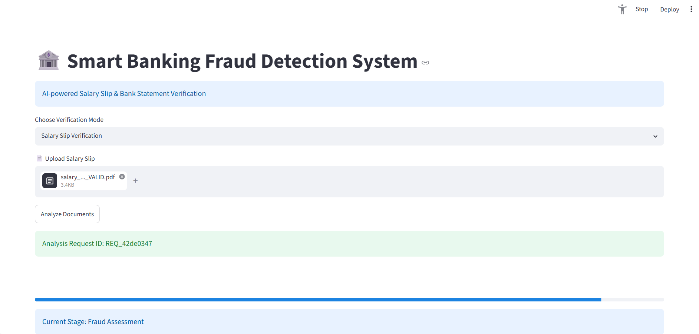
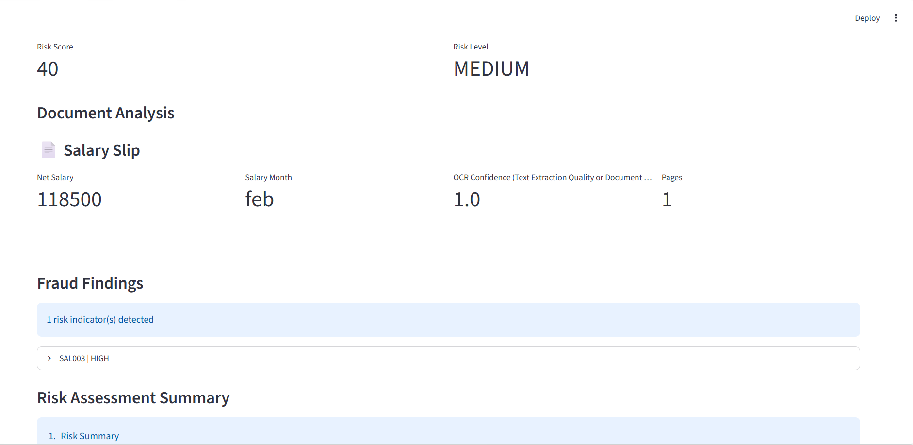
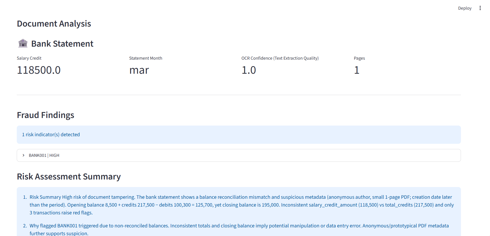

# 🏦 Smart Banking Fraud Detection System

An AI-powered banking document verification platform that detects potential fraud indicators in Salary Slips and Bank Statements using OCR extraction, metadata analysis, rule-based validation, and AI-generated risk assessment.

Supports:

👉 Salary Slip Verification
👉 Bank Statement Verification
👉 Combined Document Verification
👉 Payroll Arithmetic Validation (SAL003)
👉 Balance Reconciliation Validation (BANK001)
👉 AI Risk Assessment & Recommendations
👉 Streamlit Dashboard + FastAPI Backend
👉 Celery & Redis Asynchronous Processing

---

# 📸 Demo Screenshots

### 🖥️ Fraud Detection Dashboard



### 📄 Salary Slip Validation



### 🏦 Bank Statement Validation


---

# 📁 Project Structure

```text
smart-banking-fraud-detection-system/

├── app/
│   ├── api/
│   ├── services/
│   ├── workers/
│   ├── repositories/
│   └── models/
│
├── configs/
│   └── rules/
│
├── scripts/
│   └── start_all.bat
│
├── ui/
│
├── temp_storage/
│
├── README.md
├── TESTING.md
└── FUTURE_ENHANCEMENTS.md
```

---

# 🚀 Features

* Upload Salary Slip PDFs
* Upload Bank Statement PDFs
* Combined document verification
* OCR-based data extraction
* PDF metadata analysis
* Data normalization engine
* Rule-based fraud detection
* Cross-document validation
* AI-generated fraud assessment
* Risk scoring engine
* Streamlit dashboard
* Asynchronous processing using Celery & Redis

---

# ⚙️ Setup Instructions

## 1. Clone Repository

```bash
git clone https://github.com/Spandit11/smart-banking-fraud-detection-system
cd smart-banking-fraud-detection-system
```

## 2. Create Virtual Environment

```bash
python -m venv .venv
```

## 3. Activate Environment

### Windows

```bash
.venv\Scripts\activate
```

### Linux / Mac

```bash
source .venv/bin/activate
```

## 4. Install Dependencies

```bash
pip install -r requirements.txt
```

## 5. Start Redis

```bash
redis-server
```

---

# 💻 Run the Application

Start the complete application:

```bash
scripts\start_all.bat
```

This automatically starts:

* FastAPI Backend
* Celery Worker
* Streamlit UI

---

# 🌐 Application URLs

### Streamlit Dashboard

```text
http://localhost:8501
```

### FastAPI Swagger

```text
http://localhost:8000/docs
```

---

# 🧠 Fraud Detection Rules

## Salary Validation

* SAL001 – Salary Missing
* SAL002 – Unusually High Salary
* SAL003 – Payroll Arithmetic Validation

## Bank Validation

* DOC001 – Low Transaction Activity
* BANK001 – Balance Reconciliation Validation

## Metadata Validation

* META001 – Low OCR Confidence
* META002 – Invalid Page Count
* META003 – Missing Producer Metadata

## Cross Validation

* CROSS001 – Salary Mismatch
* CROSS002 – Month Mismatch
* CROSS003 – Missing Salary Credit
* CROSS004 – Invalid Bank Statement
* CROSS005 – Invalid Salary Slip

---

# 🧪 Testing

The following scenarios have been successfully validated:

✅ Valid Salary Slip

✅ Fraud Salary Slip (SAL003)

✅ Valid Bank Statement

✅ Fraud Bank Statement (BANK001)

✅ Combined Verification

Refer to:

```text
TESTING.md
```

for detailed test evidence.

---

# 🧠 Technologies Used

* Streamlit
* FastAPI
* Celery
* Redis
* Python
* OCR Processing
* OpenAI / Azure OpenAI
* JSON Rule Engine

---

# 📈 Current Version

Version: 1.2

Status: Demo Ready

Implemented:

✅ Salary Slip Verification

✅ Bank Statement Verification

✅ Combined Verification

✅ SAL003 Payroll Validation

✅ BANK001 Balance Validation

✅ AI Risk Assessment

---

# 🔮 Future Enhancements

## Phase 2

* SAL004 Amount-in-Words Validation
* SAL005 Statutory Deduction Validation
* DOC002 Document Type Validation
* PDF Authenticity Checks
* Metadata Consistency Validation

## Phase 3

* AI Agent-based Fraud Investigation
* ML Fraud Scoring
* Historical Pattern Analysis
* Transaction Analytics Engine

## Phase 4

* Docker Support
* Azure Deployment
* Real-time Dashboard
* Audit Repository

Refer to:

```text
FUTURE_ENHANCEMENTS.md
```

for detailed roadmap.

---

# 📢 Author

Developed as an AI-powered Fraud Detection Proof of Concept demonstrating document verification, fraud analysis, and AI-assisted risk assessment using modern Python and cloud-native architecture patterns.

# 👨‍💻 Author

**Sourabh Pandit**

Generative AI • Agentic AI • Azure PaaS • Cloud-Native .NET Solutions

This project was developed as a practical Proof of Concept to explore AI-assisted fraud detection, document intelligence, rule engines, and modern cloud architecture patterns.

### Connect

* LinkedIn: [linkedin Profile](www.linkedin.com/in/sourabh-pandit-b2570212)
* GitHub: [GitHub URL)](https://github.com/Spandit11)

### Project Focus Areas

* AI-Powered Fraud Detection
* Document Intelligence
* Banking Domain Validation
* FastAPI & Streamlit
* Celery & Redis
* Azure Architecture Patterns
